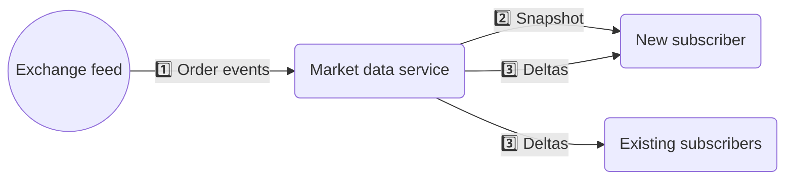
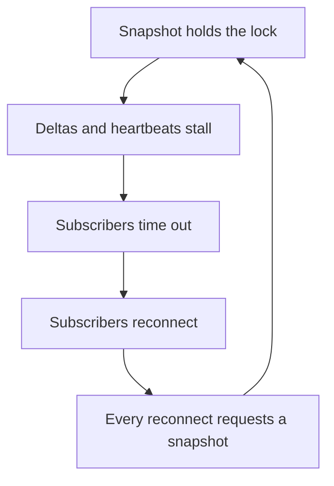
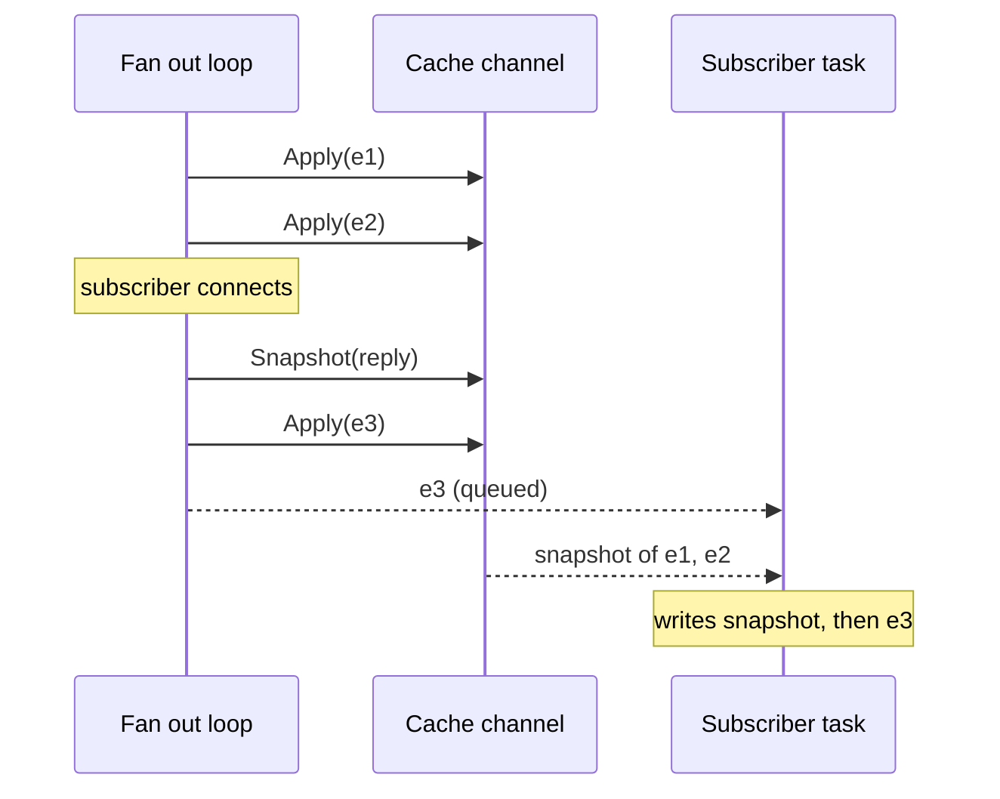

# Snapshots without locks

## The problem

A market data service sits between an exchange feed and it's subscribers. The feed tells it that order 47 changed price, order 12 was pulled, order 903 is new. Subscribers (pricing engines, screens, risk systems) connect over a websocket, and each one needs two things:

1. A **snapshot** - the state of the book **at the point of connection**,
2. A **delta stream** - every change after that, in order, exactly once.



These are different bits of work:

| | Snapshot | Delta |
| -- | -- | -- |
| How often | Once per connection | Constantly |
| Cost | Every order in the book | One order |
| Who's waiting | One subscriber, who expects to wait a bit | Everyone else, who doesn't |

### The bad implementation

Put the book in a dictionary, wrap it in a lock:

```rust
struct OrderRepository {
    orders: Arc<RwLock<HashMap<OrderId, Order>>>,
}

impl OrderRepository {
    async fn apply(&self, event: OrderEvent) {
        apply(&mut *self.orders.write().await, event);
    }

    async fn snapshot(&self) -> Bytes {
        serialise_book(&*self.orders.read().await)
    }
}
```

This is fine until you look at what `snapshot` does. It holds the read lock for the entire serialisation, blocking deltas from being processed and broadcast. So while one subscriber is connecting, other subscribers observe inceased latency. It gets worse if heartbeats go out on the same path:



Once you're in that loop, you get snapshot requests leading to more delayed heartbeats, leading to more disconnections and snapshot resets. This can easily spiral.

## A better implementation

### Registering a new subscriber

When a subscriber connects spawn a task for it, give it a queue for deltas, and a one shot channel that the snapshot will be written to eventually:

```rust
const DELTA_QUEUE: usize = 1024;

pub struct Subscriber {
    deltas: mpsc::Sender<Bytes>,
}

impl Subscriber {
    pub fn new(socket: Socket) -> (Self, oneshot::Sender<Bytes>) {
        let (deltas, delta_rx) = mpsc::channel(DELTA_QUEUE);
        let (snapshot, snapshot_rx) = oneshot::channel();
        tokio::spawn(write(socket, snapshot_rx, delta_rx));
        (Self { deltas }, snapshot)
    }

    pub fn send(&self, delta: Bytes) -> Result<(), TrySendError<Bytes>> {
        self.deltas.try_send(delta)
    }
}

async fn write(
    socket: Socket,
    snapshot: oneshot::Receiver<Bytes>,
    mut deltas: mpsc::Receiver<Bytes>,
) {
    let Ok(snapshot) = snapshot.await else { return };
    if socket.send(snapshot).await.is_err() {
        return;
    }

    while let Some(delta) = deltas.recv().await {
        if socket.send(delta).await.is_err() {
            return;
        }
    }
}
```

With this implementation, deltas are being buffered onto the subscribers queue until the snapshot turns up. By using `Bytes`, the subscriber is domain agnostic,and each delta is only serialised once (regardless of the number of consumers).

### The snapshot cache

The book lives in a task that reads one command at a time:

```rust
enum Command {
    Apply(OrderEvent),
    Snapshot(oneshot::Sender<Bytes>),
}

async fn run(mut commands: mpsc::UnboundedReceiver<Command>) {
    let mut book = HashMap::new();

    while let Some(command) = commands.recv().await {
        match command {
            Command::Apply(event) => apply(&mut book, event),
            Command::Snapshot(reply) => {
                let _ = reply.send(serialise_book(&book));
            }
        }
    }
}
```

`book` is a plain `HashMap`, and as it's only being interacted with in the `commands.recv()` loop, we don't need to worry about contention across threads.

The queue here is unbounded - dropping an `Apply` would quietly corrupt the book, and we'd need a snapshot reset from the venue. There's no real way to recover here, your app is just too slow.

### How ordering is guaranteed

The fan out loop owns the list of subscribers, and it's the only thing that talks to the cache:

```rust
loop {
    tokio::select! {
        Some(socket) = new_subscribers.recv() => {
            let (subscriber, snapshot) = Subscriber::new(socket);
            subscribers.push(subscriber);
            cache.send(Command::Snapshot(snapshot));
        }
        Some(event) = events.recv() => {
            let delta = serialise(&event);
            subscribers.retain(|s| s.send(delta.clone()).is_ok());
            cache.send(Command::Apply(event));
        }
        else => break,
    }
}
```

The key here is `select!`: it runs one branch body to completion before it looks at the other one, so a registration can never land in the middle of an event. Adding the subscriber to the list and putting it's snapshot request on the queue happen together.

Second, the channel is FIFO and only this loop writes to it. This means that the position of the snapshot request in the channel represents the exact point at which the snapshot was requested, and subsequent deltas being buffered by the subscriber are added afterwards:



So for any event and any subscriber:

| Event handled | In the snapshot? | Sent as a delta? |
| -- | -- | -- |
| Before the subscriber connected | Yes, it reached the cache before the snapshot | No, it wasn't in the list yet |
| After the subscriber connected | No, the snapshot had already been taken | Yes, it was in the list |

### Why there's no lock

A lock is there to stop two threads touching the same data at once.

`select!` is what makes that practical once you've got more than one input. It takes both sources of work, picks whichever is ready, and runs that branch with `&mut` access to the book. You get your mutual exclusion from ownership instead of from a runtime primitive, and it costs nothing because there's nothing to contend.

## An even better design

If you can redesign the protocol, using sequence numbers and having seperate interfaces to request snapshots / stream deltas allows you to offload delta buffering to consumers. In scenarios where there are a lot of consumers, and you need deterministic performance for producers, this is better - just make sure the snapshot request / delta stream don't block eachother via locks!
